# FrameLoad 🚀

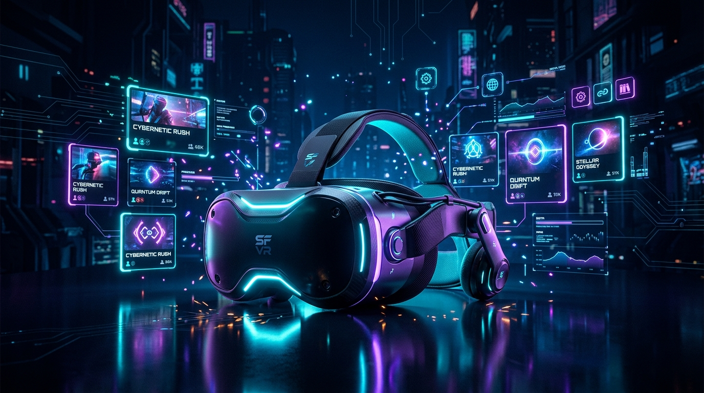

**All-in-One On-Device VR Sideloading, Catalog Downloader & Library Manager for the Steam Frame**

[](https://github.com/Crypto90/frameload)
[](https://github.com/Crypto90/frameload/releases)
[](https://github.com/Crypto90/frameload/actions)
[](#)
[](#)
[](https://ko-fi.com/K3K314GUP?ref=frameload_readme)

---

## 🌟 Overview

**FrameLoad** brings the best of both worlds directly to your **Steam Frame VR device**:
- The **on-device browsing, downloading, and catalog engine** of **Rookie Sideloader** and **QRookie**
- The **Steam Frame Lepton container compatibility layer, OpenXR translation, and Steam shortcuts integration** of **FramePort** and **FrameDrop**

Unlike PC-dependent companion tools, **FrameLoad runs directly ON-DEVICE on the Steam Frame** (which runs standalone SteamOS / Linux ARM64). You can browse thousands of VR titles, download them, automatically apply Lepton container patches, and register them into your Steam library with high-resolution vertical grid posters—**all from inside your headset without ever needing a companion PC!**

---

## ⚡ Key Features

- **🎮 100% On-Device & Standalone:**
  - Runs natively on SteamOS (ARM64 / aarch64).
  - Open it directly in SteamVR, Gaming Mode, Desktop Mode, or access it over local Wi-Fi from your phone/tablet/laptop.
- **🌐 Direct Mirror & Catalog Integration:**
  - Integrated with VRP public mirrors (`meta.7z`, `VRP-GameList.txt`) with instant search, genre filtering, and sorting.
  - Multi-part archive download with auto-resumption (`Range: bytes`), download speed metrics (EMA), and ETA calculations.
- **📦 Automated Lepton Container Setup:**
  - Installs games to `~/Applications/quest-frame/<package>/`.
  - Configures Valve's Lepton Android container runtime (`lepton-app/`, `lepton-data/`, `lepton-shaders/`).
  - Auto-repairs Android external permissions (`/sdcard/Android/data/<package>/files/`).
  - Automatically isolates containers and cleans up rootless podman keyring quota leaks (`keyring = false`).
- **🔧 Compatibility & Translation Engine:**
  - VR APKs: Automatically detected and patched with FrameBridge OpenXR shims (`libopenxr_loader_generic.so`, `libframe_xrshim.so`, `libovrplatformcompat.so`).
  - 2D Flat Android Apps: Automatically detected and tagged with `lepton-show-flatscreen` to render as floating virtual windows in SteamVR.
  - PCVR Games: Compatibility with Proton ARM64, Revive, and WineOpenXR.
- **🎨 Complete Steam Library Integration:**
  - Pure Python binary `shortcuts.vdf` parser & serializer with automatic backup protection.
  - Automatically fetches and formats complete Steam Grid Artwork:
    - Vertical Poster (`600x900`)
    - Horizontal Banner (`460x215`)
    - Hero Background (`1920x620`)
    - Logo (`logo.png`) and Icon (`icon.png`)
  - Seamless 1-click launch via `steam://rungameid/<gameid>`.
- **🕹️ Dual Input Engine (VR Controller + Gamepad Navigation):**
  - Built-in HTML5 Gamepad API navigator (`gamepad.js`):
    - D-Pad / Left Stick: Navigate cards and controls with glowing focus rings.
    - LB / RB: Quick tab switching.
    - `A`: Select / Install / Play.
    - `B`: Back / Close modals.
    - `X`: Action button.
    - `Y`: Instant search focus.
- **💾 Save Data & Game Manager:**
  - 1-click game save export/import (`tar.gz`).
  - Per-game runtime settings editor (72Hz, 90Hz, 120Hz refresh rates, resolution scaling, MSAA, controller model rendering).
  - Clean uninstaller: Stops running containers, purges game data, and cleans Steam library shortcuts.
- **🎵 Mod & Custom Content Injector:**
  - **Beat Saber Custom Songs:** Drop any custom song `.zip` directly from the Web UI or CLI; FrameLoad extracts it into `CustomSongs/`, repairs container permissions (`0777`), and makes it immediately available in game.
  - **Mod Packs & Textures:** Inject mods directly into `lepton-data/external/Android/data/<package>/files/` with auto-repair permissions, inspection, and deletion.
- **🖥️ 2D Flat Android Window Presets:**
  - Run non-VR Android games and APKs in floating virtual cinema screens within SteamVR.
  - Choose between tailored display presets:
    - **Tablet Mode:** 1600x1000 (16:10 Landscape)
    - **Mobile Phone:** 900x1600 (9:16 Portrait)
    - **Desktop Cinema:** 1920x1080 (16:9 Widescreen)
    - **Ultrawide Display:** 2560x1080 (21:9)
  - Configures `lepton-window.json` and exports `LEPTON_WINDOW_WIDTH`, `LEPTON_WINDOW_HEIGHT`, and `LEPTON_ORIENTATION`.
- **🪟 Windows PCVR & Flat EXEs via Proton:**
  - Sideload standalone Windows games and PCVR titles (`.exe` or directories).
  - Auto-detects OpenXR / OpenVR / SteamVR DLLs (`openvr_api.dll`, `openxr_loader.dll`, `vrclient.dll`).
  - Auto-configures Proton ARM64 runtime (GE-Proton, Proton Experimental, Proton 9/8 via FEX-Emu), `WINEPREFIX`, and WineOpenXR routing (`XR_RUNTIME_JSON="/usr/share/openxr/1/openxr_steamvr.json"`).
- **🐧 Linux Native ARM64 Binaries & AppImages:**
  - Sideload Linux `.AppImage`, ELF native binaries, and `.sh` scripts.
  - Auto-applies executable permissions (`chmod +x`), generates `launch.sh`, and integrates with Steam under the `"Linux Native"` tag.
- **🔗 One-Click Deep Linking (`frameload://` Protocol):**
  - Registered desktop URL protocol handler (`x-scheme-handler/frameload`).
  - 1-click install links from web browsers or community sites:
    - `frameload://install?url=<download_url>&pkg=<package>&title=<title>`
    - `frameload://sideload?path=<file_path>&title=<title>`
    - `frameload://launch?pkg=<package>`
    - `frameload://sync`
- **💾 Full MicroSD Card & Multi-Drive Storage:**
  - **Native MicroSD Detection:** Automatically discovers formatted MicroSD cards mounted by SteamOS (`/run/media/deck/*`, `mmcblk`), external USB drives, and custom storage paths.
  - **Selectable Install Location:** Install catalog downloads or sideloaded apps directly to Internal SSD or MicroSD Card.
  - **1-Click Game Migration:** Move installed games between Internal Storage and MicroSD Card seamlessly—automatically moves container directories, updates launch scripts, and refreshes Steam shortcuts.
  - **Multi-Drive Library Scanning:** Browse all installed games across all connected drives with clear MicroSD badges.
- **📦 Universal Package & Multi-Format Sideloading:**
  - **Split APK & Bundle Support:** Directly install `.xapk`, `.apks`, and `.zip` archives containing base APK, split configuration APKs, and OBB data trees.
  - **Loose Directory Sideloading:** Point to or drag an extracted game folder from a USB drive or MicroSD card; FrameLoad automatically pairs APKs with matching `com.pkg/` OBB folders.
  - **Pre-Install Package Inspection:** Inspect package name, title, engine (Unity, Unreal, Godot), VR requirements, and OBB status before installing.
- **📊 Steam-Style Storage Manager:**
  - Designed after Steam's storage settings with horizontal drive switcher cards (Internal SSD, MicroSD card).
  - Multi-colored segmented bar visualizer: Blue (Games), Teal (Saves & Data), Amber (Shaders & Cache), Purple (System), and Grey (Free Space).
  - Instant disk space breakdown per game (App APKs, saves, shader caches, artwork).
  - Multi-selection checkboxes with floating batch action bar and space reclaimed calculation.
  - Safe batch uninstallation with automatic save game archiving.
  - 1-click download cache cleanup and Lepton shader cache reset.
- **⚡ 1-Click In-Headset Self-Updater & OTA Management:**
  - **FrameLoad Self-Updating Daemon:** Automatically checks GitHub releases and remote git heads in the background without requiring a PC, terminal, or keyboard.
  - **In-Headset Update Alerts:** Displays a pulsating animated badge in the top header and a prominent dismissable banner showing the new version and changelog.
  - **1-Click Update & Seamless Service Reload:** 1-click button pulls the update (via git or GitHub standalone tarball bundle), refreshes container configurations, desktop shortcuts, and automatically restarts the background `systemd` daemon with zero user intervention.
  - **Installed VR Game Updates:** Compares installed titles against the VRP catalog mirror, highlighting games with newer releases.
  - **1-Click Game Upgrades:** Upgrade individual games or batch update all titles with one click while safely preserving all save data (`lepton-data/`).

---

## 📸 App Screenshots

| 🌐 Browse Mirror Catalog | 🎮 Installed Library |
|:---:|:---:|
| [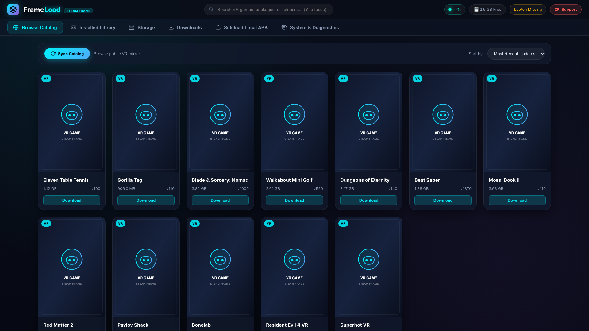](docs/images/screenshot_catalog.png) | [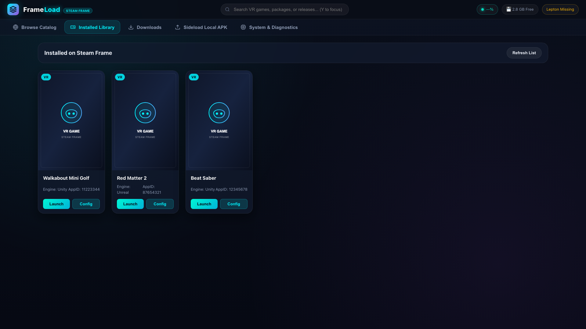](docs/images/screenshot_library.png) |
| *Browse, search, and queue VR titles with live Ko-fi chip, battery, storage & Lepton telemetry* | *Manage installed games, launch in VR, and configure FrameBridge per-title settings* |

| 📊 Steam-Style Storage Manager | 📥 Sideload & 2D Window Presets |
|:---:|:---:|
| [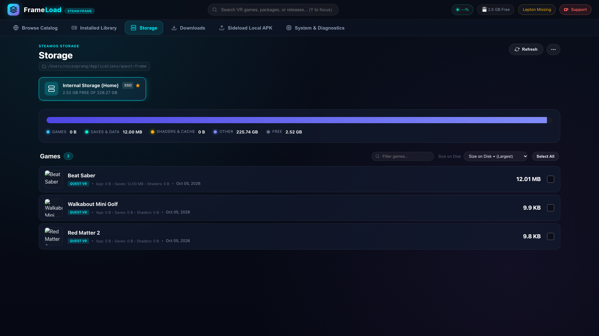](docs/images/screenshot_storage.png) | [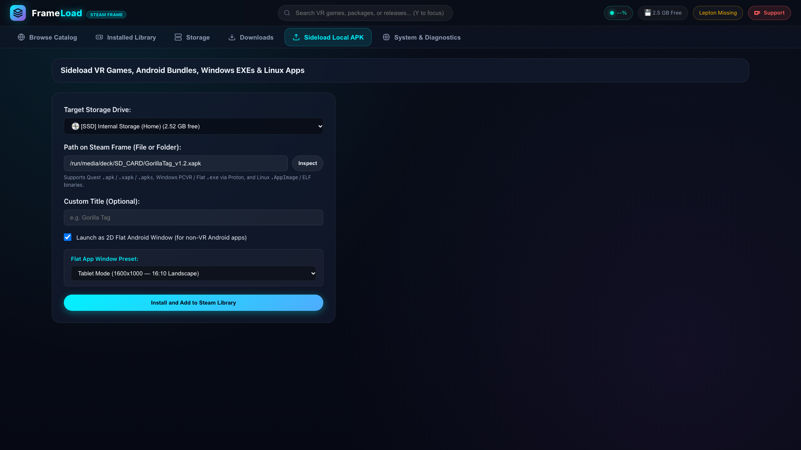](docs/images/screenshot_sideload.png) |
| *Segmented storage visualizer, multi-drive mover (Internal SSD & MicroSD), and cache cleanup* | *Sideload Quest APKs, Windows Proton EXEs, Linux apps, and toggle flat theater presets* |

| 🛠️ System & Diagnostics with Ko-fi | 🎵 Game Details & Custom Songs / Mods |
|:---:|:---:|
| [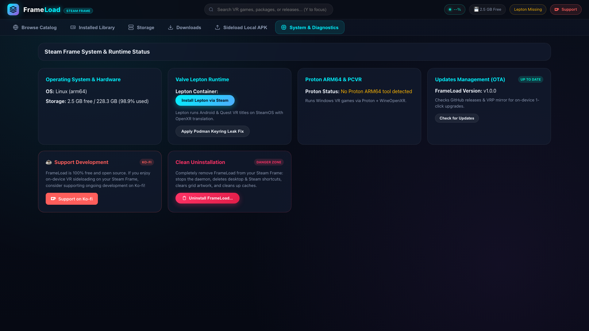](docs/images/screenshot_system.png) | [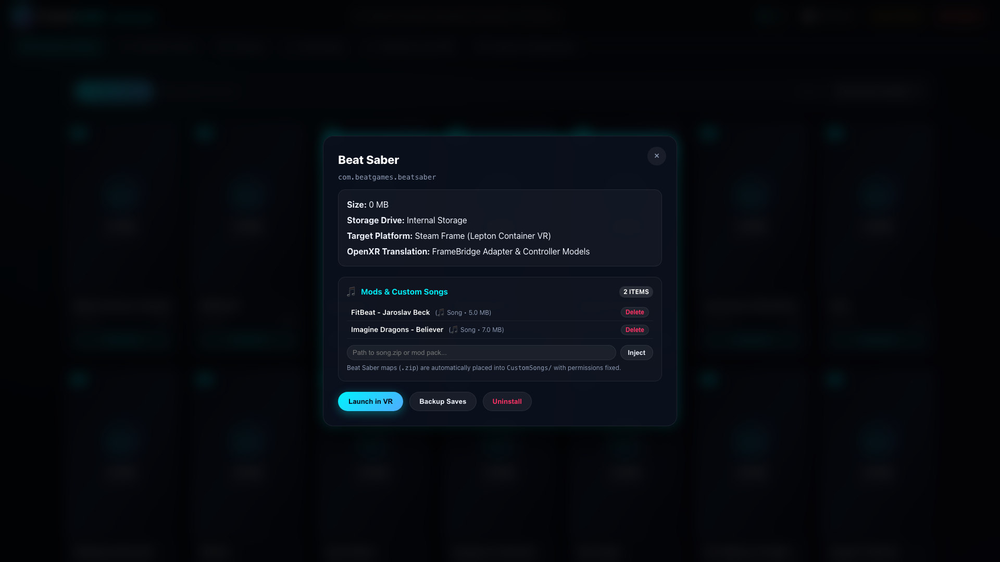](docs/images/screenshot_modal.png) |
| *Live telemetry (Lepton VR, FEX-Emu Proton ARM64), OTA updates, and Support on Ko-fi card* | *Per-game settings, drive migration, and Beat Saber custom songs & mod injector* |

---

## 🎨 Steam Grid Artwork & Visual Assets

FrameLoad includes high-resolution, pixel-perfect artwork tailored for **SteamOS Gaming Mode**, **SteamVR**, and the **Steam Library** in all official Steam formats:

### 🎮 Steam Grid Formats & Posters

| 📱 Steam Frame Device Poster (`600x900`) | 🌌 Portal Edition Poster (`600x900`) | 🏷️ Steam Grid Banner (`920x430`) |
|:---:|:---:|:---:|
| 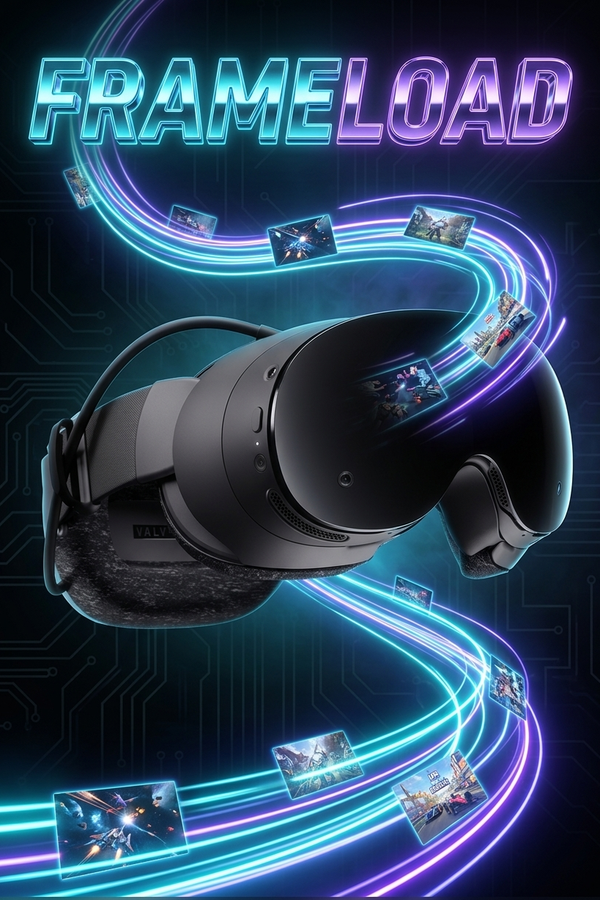 |  | 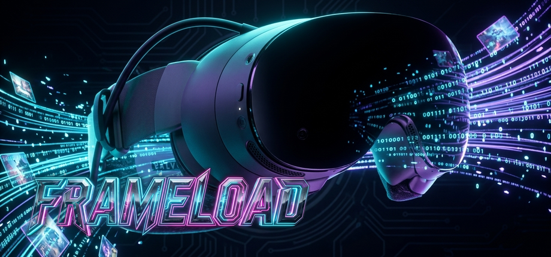 |
| *Steam Frame Headset Capsule* | *Vibrant SteamVR Portal Edition* | *Steam Library Grid Banner (460x215)* |

| 🥽 Steam Frame Headset Icon (`512x512`) | ⚡ FrameLoad Hologram Icon (`512x512`) | 🏷️ Transparent Title Logo |
|:---:|:---:|:---:|
| 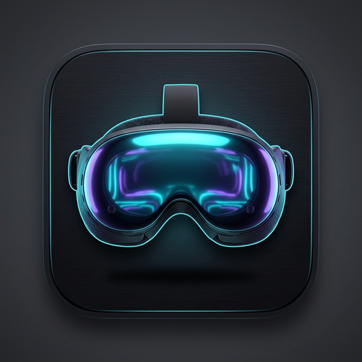 |  | 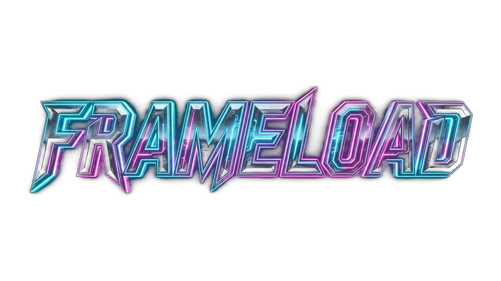 |
| *Headset Device App Icon* | *Cyan VR Vortex Glyph* | *Transparent Overlay Logo* |

### 🖼️ Steam Hero Backgrounds (`1920x620`)

**Steam Frame Hardware Edition Hero:**
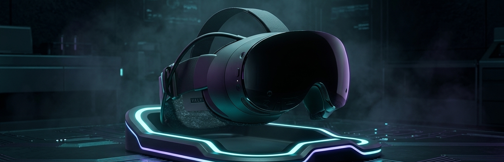

**SteamVR Cosmic Portal Edition Hero:**


### 🌟 Concept Banner Artworks

| 🌊 Stream Edition | 🛠️ Hardware Edition | 🚪 Gateway Edition |
|:---:|:---:|:---:|
| 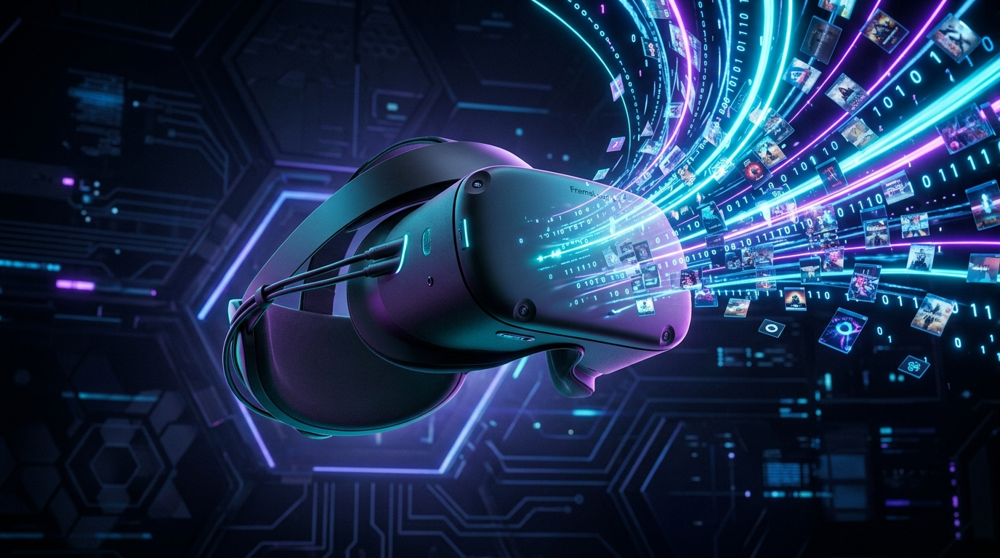 | 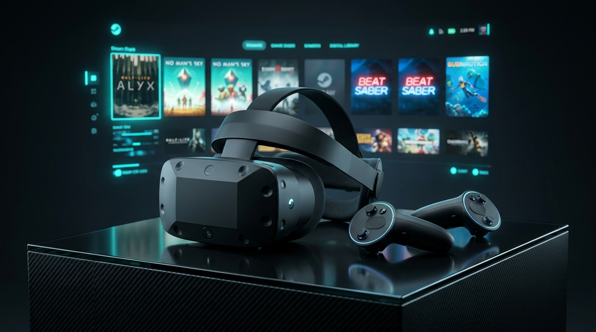 | 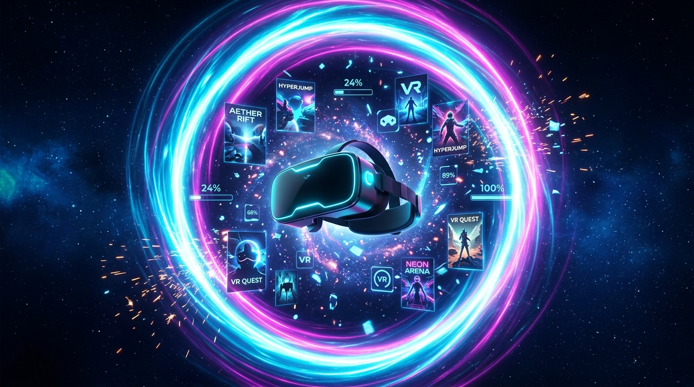 |
| *Data Stream & Wireless Sideloading* | *Industrial Steam Frame Device* | *Dimensional VR Portal Gateway* |

---

## 🚀 Quick Start (On Your Steam Frame)

### ⚡ 1-Click Install (Single Command)

Open **Konsole** in SteamOS Desktop Mode (or connect via SSH) and run:

```bash
curl -fsSL https://raw.githubusercontent.com/Crypto90/frameload/main/install.sh | bash
```

> [!TIP]
> Click the **Copy** button on the top right of the code block above to copy the command directly to your clipboard!

---

### 📦 Alternative: Self-Extracting Offline Installer

If you prefer downloading a single pre-built installer package without needing `git`:

```bash
# Grep latest release tag and download the standalone installer:
TAG=$(curl -s https://api.github.com/repos/Crypto90/frameload/releases/latest | grep '"tag_name":' | cut -d'"' -f4)
curl -fsSLO "https://github.com/Crypto90/frameload/releases/download/${TAG:-v1.0.5}/frameload-installer.sh"
bash frameload-installer.sh
```

*(Or via GitHub's direct latest redirect: `curl -fsSLO https://github.com/Crypto90/frameload/releases/latest/download/frameload-installer.sh`)*

---

### 🔧 Alternative: Manual Git Clone

```bash
cd ~/
git clone https://github.com/Crypto90/frameload.git
cd frameload
./install.sh
```

---

### What the Installer Does Automatically:
1. Configures `~/.config/containers/containers.conf` to stop rootless podman leaking kernel keyrings (`keyring = false`).
2. Installs standalone static 7-Zip (`7za`) archive extraction tools.
3. Creates the desktop launcher `~/.local/share/applications/frameload.desktop`.
4. Enables the background user service `frameload.service` on port `5050`.
5. Adds **FrameLoad** directly to your SteamVR & Steam library as a Non-Steam Game shortcut with complete vertical poster grid artwork.

---

### 🎮 Launching FrameLoad

- **In VR / Gaming Mode:** Open your Steam Library and select **FrameLoad**.
- **In Desktop Mode:** Open Application Launcher → **Games** → **FrameLoad**.
- **From Any Web Browser:** Navigate to:
  ```
  http://localhost:5050
  ```
  or from your phone / tablet / PC on the same Wi-Fi:
  ```
  http://<steam-frame-ip>:5050
  ```

---

## 🗑️ Clean Uninstallation

If you ever wish to completely remove FrameLoad and all its traces from your device:

### ⚡ 1-Click Clean Uninstall (Single Command)

```bash
curl -fsSL https://raw.githubusercontent.com/Crypto90/frameload/main/uninstall.sh | bash
```

Or from your terminal if already installed:

```bash
bash ~/Applications/FrameLoad/uninstall.sh
```

### Options & Flags:

| Option | Description |
| :--- | :--- |
| **`./uninstall.sh`** | Interactive mode (asks whether to keep games and save backups). |
| **`-y` / `--yes`** | Skips prompts; cleanly removes daemon, desktop launcher, Steam shortcuts, and caches while preserving installed games and saves. |
| **`--purge-games`** | Also deletes all sideloaded VR games in `~/Applications/quest-frame/` and on MicroSD cards. |
| **`--purge-all`** | Total clean wipe: removes app, caches, games, saves, and backups. |
| **`--keep-backups`** | Preserves game save backups in `~/.local/share/frameload/backups/` *(default: yes)*. |

### What the Uninstaller Cleans Up Automatically:
1. Stops and deletes the background systemd service (`frameload.service`).
2. Removes the Desktop launcher (`~/.local/share/applications/frameload.desktop`).
3. Removes FrameLoad and all 5 Grid artwork files from Steam (`shortcuts.vdf` and `userdata/*/config/grid/`).
4. Kills any lingering Lepton container shims.
5. Deletes caches, metadata, and temporary files (`~/.local/share/frameload/`).
6. Optionally deletes installed VR games and preserves or removes save game backups according to your choice.

---

## 🛠️ Command-Line Interface (CLI)

FrameLoad also includes a powerful CLI:

```bash
# Start Web Server & REST API
frameload serve --host 0.0.0.0 --port 5050

# Display Steam Frame system, Lepton, Proton, and battery telemetry
frameload info

# List installed games
frameload list

# Synchronize VR catalog metadata from mirror
frameload sync

# Search catalog
frameload search "Beat Saber"

# Install a local package (Quest APK, Windows Proton EXE, Linux AppImage)
frameload install /path/to/game.xapk --title "My Game"

# Install as 2D Flat Android window with customized preset
frameload install /path/to/app.apk --flat --window-preset tablet

# Inject Beat Saber custom song or mod package
frameload inject-mod com.beatgames.beatsaber /path/to/song.zip --name "SongName"

# Handle a frameload:// deep link URL directly
frameload handle-url "frameload://launch?pkg=com.beatgames.beatsaber"

# Launch an installed game
frameload launch com.beatgames.beatsaber

# Cleanly uninstall a game and remove its Steam shortcut
frameload uninstall com.beatgames.beatsaber --keep-saves

# Completely uninstall FrameLoad itself and remove all system traces
frameload uninstall-app --keep-backups
```

---

## 📁 Storage Layout

| Directory | Purpose |
|---|---|
| `~/Applications/quest-frame/<pkg>/` | Game container anchor, `launch.sh`, `deployment.json`, and artwork |
| `~/Applications/quest-frame/<pkg>/lepton-app/` | `game.apk` and `obb/` files |
| `~/Applications/quest-frame/<pkg>/lepton-data/` | Container storage (`/sdcard/Android/data/<pkg>/files/` and save files) |
| `~/.local/share/frameload/data/` | Mirror catalog metadata (`VRP-GameList.txt`, thumbnails) |
| `~/.local/share/frameload/cache/` | In-progress downloads |
| `~/.local/share/frameload/backups/` | Exported save game archives |
| `~/.local/share/Steam/userdata/<id>/config/` | Steam `shortcuts.vdf` and `grid/` artwork |

---

## 🎮 VR Controller & Gamepad Bindings

| Button | Action |
|---|---|
| **D-Pad / Left Stick** | Navigate between cards, buttons, and inputs |
| **A / Cross** | Select / Open Game Details / Confirm |
| **B / Circle** | Back / Close Modal |
| **X / Square** | Quick Download / Launch Game |
| **Y / Triangle** | Jump to Search Bar |
| **LB / RB (L1 / R1)** | Previous / Next Tab |

---

## ☕ Support the Project

If you love using **FrameLoad** on your Steam Frame and want to support ongoing development, new features, and maintenance, you can support me on Ko-fi:

<p align="left">
  <a href="https://ko-fi.com/K3K314GUP?ref=frameload_readme" target="_blank" rel="noopener noreferrer">
    
  </a>
</p>

[](https://ko-fi.com/K3K314GUP?ref=frameload_readme)

---

## 📜 License

GPL-3.0 License. Built for the Steam Frame and open VR gaming community.
